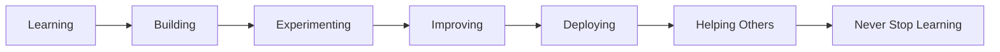
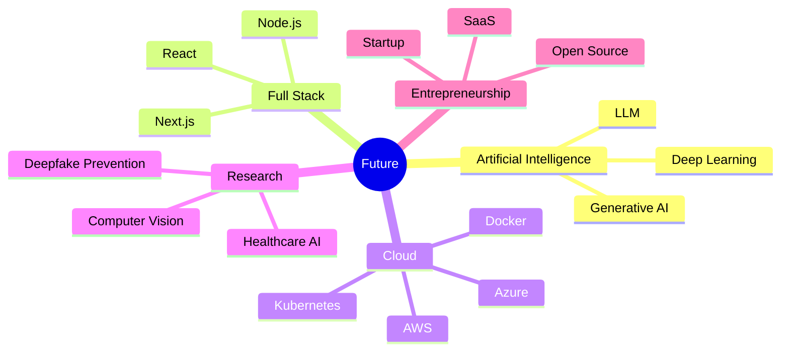

````markdown
<!-- ========================================================= -->
<!--                  RADHEESH CYBER PROFILE                   -->
<!-- ========================================================= -->

<p align="center">


</p>

<h1 align="center">


</h1>

---

<p align="center">


</p>

---

# 🌌 SYSTEM INITIALIZATION

```text
██████╗  █████╗ ██████╗ ██╗  ██╗███████╗███████╗███████╗██╗  ██╗
██╔══██╗██╔══██╗██╔══██╗██║  ██║██╔════╝██╔════╝██╔════╝██║  ██║
██████╔╝███████║██║  ██║███████║█████╗  █████╗  ███████╗███████║
██╔══██╗██╔══██║██║  ██║██╔══██║██╔══╝  ██╔══╝  ╚════██║██╔══██║
██║  ██║██║  ██║██████╔╝██║  ██║███████╗███████╗███████║██║  ██║
╚═╝  ╚═╝╚═╝  ╚═╝╚═════╝ ╚═╝  ╚═╝╚══════╝╚══════╝╚══════╝╚═╝  ╚═╝
````

```yaml
Booting Cyber Interface...

Loading Artificial Intelligence...
████████████████████████████ 100%

Loading Projects...
████████████████████████████ 100%

Loading Portfolio...
████████████████████████████ 100%

Loading Creativity...
████████████████████████████ 100%

Loading Innovation...
████████████████████████████ 100%

Access Granted...

Welcome Visitor.
```

---

# 👋 HELLO WORLD!

```cpp
class Radheesh
{
public:

string Role="Computer Science Engineer";

string Passion="Building Intelligent Software";

string Focus="Artificial Intelligence";

string Specialty="Full Stack Development";

string Mission="Develop Technology That Solves Real World Problems";

};
```

---

# 🧠 WHO AM I?

```text
╔══════════════════════════════════════════════════════╗
║                                                      ║
║          DIGITAL PROFILE : RADHEESH KUMAR R          ║
║                                                      ║
╠══════════════════════════════════════════════════════╣
║                                                      ║
║ STATUS          : ONLINE                             ║
║                                                      ║
║ LOCATION        : Chennai, India                     ║
║                                                      ║
║ PROFESSION      : Computer Science Engineer          ║
║                                                      ║
║ SPECIALIZATION  : AI + Full Stack                    ║
║                                                      ║
║ DESIGN STYLE    : Modern Cyberpunk                  ║
║                                                      ║
║ MISSION         : Creating Intelligent Solutions     ║
║                                                      ║
║ CURRENT STATE   : Building Future Technologies       ║
║                                                      ║
╚══════════════════════════════════════════════════════╝
```

---

# ⚡ DIGITAL MISSION

> "Technology becomes meaningful when it solves real-world problems."

I believe software should not only be functional but also intelligent, visually engaging, and impactful. My work combines **Artificial Intelligence**, **Full Stack Development**, and **creative UI/UX** to build solutions that address practical challenges.

---

# 🚀 CURRENT OBJECTIVES

* 🧠 Artificial Intelligence
* 🌐 Full Stack Web Development
* 📱 Modern Application Development
* 🎨 Professional UI/UX
* 🔥 Interactive Animations
* ☁ Cloud Technologies
* 🤖 Automation
* 🔐 Secure Systems
* 📊 Data Visualization
* 🚀 Open Source Contributions

---

# 🌌 CYBER CORE

```text
█████████████████████████████████████

AI

█████████████████████████████████████

FULL STACK

█████████████████████████████████████

DESIGN

█████████████████████████████████████

PROBLEM SOLVING

█████████████████████████████████████

INNOVATION

█████████████████████████████████████
```

---

<p align="center">


````markdown
<!-- ========================================================= -->
<!--                    ABOUT  RADHEESH                        -->
<!-- ========================================================= -->

#  About Me


```yaml
Name        : Radheesh Kumar R

Location    : Chennai, Tamil Nadu, India

Education   : Computer Science & Engineering

Status      : Learning Every Single Day

Speciality  :
              • Artificial Intelligence
              • Full Stack Development
              • UI / UX Design
              • Modern Animations
              • Software Engineering

Dream       :
              Build products that impact millions
              through Artificial Intelligence and
              next-generation software.

Current Focus:
              Building AI solutions
              Research Projects
              Open Source
              Advanced React
              Node.js
              Cloud Technologies

Personality :
              Curious
              Creative
              Team Player
              Problem Solver
              Tech Explorer
```

---

# 🌌 My Philosophy

> **"Code is not just written. It is designed, engineered, optimized, and experienced."**

I love transforming ideas into elegant software that combines intelligent functionality with modern user experiences. Whether it's AI-driven applications, full-stack web development, or interactive interfaces, my goal is to create technology that solves meaningful real-world problems.

---

# 🧬 Digital DNA

```text
█████████████████████████████████████████████

PASSION

█████████████████████████████████████████████

ARTIFICIAL INTELLIGENCE

█████████████████████████████████████████████

FULL STACK DEVELOPMENT

█████████████████████████████████████████████

CREATIVITY

█████████████████████████████████████████████

INNOVATION

█████████████████████████████████████████████

CONSISTENCY

█████████████████████████████████████████████
```

---

# 🎓 Education

<table>

<tr>

<td width="80">

🎓

</td>

<td>

## Bachelor of Computer Science & Engineering

**Rajalakshmi Institute of Technology**

📍 Chennai, Tamil Nadu

📅 2024 - 2028

Focused on Software Engineering, Artificial Intelligence, Full Stack Development, UI/UX Design, Algorithms and Real-World Problem Solving.

</td>

</tr>

</table>

---

# 🌍 International Exposure

<table>

<tr>

<td width="80">

🌏

</td>

<td>

## Mobility Programme

**Universiti Tun Hussein Onn Malaysia (UTHM)**

🇲🇾 Malaysia

International Academic Mobility Programme

Learning from a global educational environment while collaborating with students from different cultural and technical backgrounds.

</td>

</tr>

</table>

---

# 💼 Professional Mindset

```text
Student
        │
        ▼
Research

        │
        ▼

Development

        │
        ▼

Innovation

        │
        ▼

Impact
```

---

# 🚀 Current Journey



---

# 🏆 Certifications

### 🌍 International Mobility Programme

> Universiti Tun Hussein Onn Malaysia

✔ International Exposure

✔ Global Collaboration

✔ Academic Exchange

---

### 🎤 International Conference

✔ Research Presentation

✔ Technical Communication

✔ Innovation

---

### © Copyright Certificate

Solar Image Processing

Official Copyright Registration

Research & Innovation

---

# 💡 Strengths

<table>

<tr>

<td>

✔ Leadership

</td>

<td>

✔ Critical Thinking

</td>

<td>

✔ Creativity

</td>

</tr>

<tr>

<td>

✔ Communication

</td>

<td>

✔ Team Management

</td>

<td>

✔ Research

</td>

</tr>

<tr>

<td>

✔ Negotiation

</td>

<td>

✔ Presentation

</td>

<td>

✔ Fast Learning

</td>

</tr>

</table>

---

# 🌟 Beyond Coding

When I'm away from my keyboard, you'll usually find me:

🏋️ Gym Training

🎹 Playing Keyboard

🎮 Exploring PC & Mobile Games

🎨 Drawing & Creative Design

🎬 Video Editing

📸 Graphic Design

🌍 Exploring Emerging Technologies

---

# 📈 Daily Workflow

```text
☀ Wake Up

↓

📚 Learn Something New

↓

💻 Build Projects

↓

☕ Coffee

↓

🎨 Design

↓

🧠 Research

↓

🚀 Improve Existing Projects

↓

🌙 Repeat
```

---

<p align="center">


## ⚡ END OF PART 2

### Next:
🚀 Featured Projects Showcase

(AURA • Solar Image Processing • Medical AI Analyzer)

````
````markdown
<!-- =============================================================== -->
<!--                    FEATURED PROJECTS                            -->
<!-- =============================================================== -->

<h1 align="center">


</h1>

---

# 🚀 FEATURED PROJECTS

> Every project represents a real-world problem solved through innovation, research, and engineering.

---

# 🛡 PROJECT 01

# AURA

## Autonomous Unity & Resilience Architecture

<p align="center">


</p>

---

# 🌌 Mission

AURA is an intelligent cyber-security platform developed to help users detect, prevent, and respond to deepfake misuse.

Instead of only identifying manipulated media, AURA focuses on **protecting digital identity** by monitoring image usage, identifying suspicious occurrences, and assisting users with automated reporting workflows.

---

# ⚡ Core Features

```text
━━━━━━━━━━━━━━━━━━━━━━━━━━━━━━━━━━━━━━

🛡 Deepfake Detection

━━━━━━━━━━━━━━━━━━━━━━━━━━━━━━━━━━━━━━

🧠 AI Image Analysis

━━━━━━━━━━━━━━━━━━━━━━━━━━━━━━━━━━━━━━

🌍 Reverse Image Monitoring

━━━━━━━━━━━━━━━━━━━━━━━━━━━━━━━━━━━━━━

🔍 Suspicious Link Analysis

━━━━━━━━━━━━━━━━━━━━━━━━━━━━━━━━━━━━━━

📧 Automatic Email Complaint Generation

━━━━━━━━━━━━━━━━━━━━━━━━━━━━━━━━━━━━━━

⚠ User Safety Recommendations

━━━━━━━━━━━━━━━━━━━━━━━━━━━━━━━━━━━━━━

📊 Smart Dashboard

━━━━━━━━━━━━━━━━━━━━━━━━━━━━━━━━━━━━━━
```

---

# 🧠 Workflow

```text

Upload Image

      │

      ▼

AI Detection Engine

      │

      ▼

Deepfake Verification

      │

      ▼

Reverse Image Search

      │

      ▼

Link Collection

      │

      ▼

Threat Analysis

      │

      ▼

Generate Report

      │

      ▼

Email Complaint

      │

      ▼

User Protection
```

---

# 💻 Technology Stack

<p align="center">


</p>

---

# 🎯 Objectives

✔ Protect Digital Identity

✔ Detect Fake Media

✔ Reduce Online Abuse

✔ Increase User Awareness

✔ Automate Reporting

✔ AI Powered Protection

✔ Easy User Experience

✔ Research Driven Development

---

# 🌐 System Architecture

```text

                USER

                  │

                  ▼

          Upload Image

                  │

                  ▼

      AI Detection Pipeline

                  │

       ┌──────────┴──────────┐

       ▼                     ▼

Deepfake Analysis     Reverse Search

       ▼                     ▼

 Image Verification   Link Detection

       └──────────┬──────────┘

                  ▼

         Threat Intelligence

                  ▼

          Report Generator

                  ▼

          Email Automation

                  ▼

           User Dashboard
```

---

# 📊 Development Status

```text

Research

█████████████████████ 100%

Planning

█████████████████████ 100%

Design

█████████████████████ 100%

Frontend

██████████████████░░░ 90%

Backend

█████████████████░░░░ 85%

Artificial Intelligence

████████████████░░░░░ 80%

Testing

███████████░░░░░░░░░░ 55%

Deployment

██████░░░░░░░░░░░░░░░ 25%
```

---

# ⭐ Why AURA?

Unlike traditional deepfake detectors that simply classify media as real or fake, **AURA** aims to provide a complete protection ecosystem by combining artificial intelligence, image tracking, link verification, and automated user assistance.

---

# 📌 Highlights

> 🛡 AI Powered

> 🌐 Modern Architecture

> 🤖 Intelligent Automation

> 🔍 Reverse Image Tracking

> ⚡ User Friendly

> 📈 Scalable

> 🔒 Security Focused

---

<p align="center">


</p>

## 🚧 More Premium Projects Below ↓
````
````markdown
<!-- =============================================================== -->
<!--              FEATURED PROJECTS - CONTINUED                      -->
<!-- =============================================================== -->

<div align="center">

# ☀ PROJECT 02

# SFASFIC

### Solar Filament Analysis using Artificial Intelligence


</div>

---

# ☀ Overview

Understanding the Sun requires analyzing enormous amounts of astronomical imagery.

This project automates the identification and measurement of **Solar Filaments**, enabling researchers to obtain precise measurements with significantly less manual effort.

---

# 🌞 Key Features

```text

☀ Automatic Solar Filament Detection

━━━━━━━━━━━━━━━━━━━━━━━━━━━━━━━━━━━━━━━

📏 Length Measurement

━━━━━━━━━━━━━━━━━━━━━━━━━━━━━━━━━━━━━━━

📐 Width Calculation

━━━━━━━━━━━━━━━━━━━━━━━━━━━━━━━━━━━━━━━

🛰 Pixel-Based Analysis

━━━━━━━━━━━━━━━━━━━━━━━━━━━━━━━━━━━━━━━

📊 Scientific Data Extraction

━━━━━━━━━━━━━━━━━━━━━━━━━━━━━━━━━━━━━━━

📈 Research Ready Output

━━━━━━━━━━━━━━━━━━━━━━━━━━━━━━━━━━━━━━━
```

---

# 🔬 AI Processing Pipeline

```text

Solar Observatory Image

           │

           ▼

Image Enhancement

           │

           ▼

Noise Reduction

           │

           ▼

Filament Detection

           │

           ▼

Boundary Segmentation

           │

           ▼

Pixel Measurements

           │

           ▼

Length & Width Calculation

           │

           ▼

Scientific Report
```

---

# 💻 Technologies

<p align="center">


</p>

---

# 🏅 Achievement

> 📜 Official Copyright Certificate

> 🌞 Scientific Research

> 🤖 Artificial Intelligence

> 📊 Image Processing

> 🔬 Astronomy

---

---

<div align="center">

# 🩺 PROJECT 03

# Medical Report Scanner

### AI Powered Medical Report Analysis


</div>

---

# ❤️ Overview

Medical reports often contain complex terminology that is difficult for patients to understand.

This AI system converts technical reports into **easy-to-understand explanations**, provides suggestions, and encourages professional consultation whenever necessary.

---

# ⚡ Features

✔ OCR Report Reading

✔ AI Analysis

✔ Medical Summary

✔ Multi-language Explanation

✔ Severity Detection

✔ Doctor Recommendation

✔ Easy-to-read Output

✔ Patient Friendly Interface

---

# 🧠 Workflow

```text

Upload Medical Report

        │

        ▼

OCR Extraction

        │

        ▼

AI Language Processing

        │

        ▼

Disease Identification

        │

        ▼

Severity Analysis

        │

        ▼

Patient Explanation

        │

        ▼

Recommendation Engine

        │

        ▼

Doctor Consultation
```

---

# 🌍 Vision

Healthcare information should be understandable by everyone.

The project focuses on **education**, **clarity**, and **guidance** rather than replacing professional medical advice.

---

# 💻 Technologies

<p align="center">


</p>

---

# 📊 PROJECT DASHBOARD

| Project | Category | Status |
|---------|----------|--------|
| 🛡 AURA | Artificial Intelligence | 🚧 Active |
| ☀ SFASFIC | Scientific Research | ✅ Completed |
| 🩺 Medical AI | Healthcare | ✅ Completed |

---

# 🚀 RESEARCH JOURNEY

```text

2024

│

├── Started Engineering

│

2025

│

├── Medical AI Analyzer

│

2026

│

├── Solar Image Processing

│

├── Copyright Achievement

│

├── International Conference

│

├── Malaysia Mobility Programme

│

└── AURA Development

│

2027+

│

└── Advanced AI Research
```

---

# 🎯 WHAT MAKES THESE PROJECTS UNIQUE?

```text

✔ Real World Problems

✔ Research Driven

✔ Artificial Intelligence

✔ User Centric Design

✔ Scalable Architecture

✔ Modern Technologies

✔ Continuous Improvement

✔ Innovation First
```

---

<div align="center">

## 🌌 "Engineering solutions that combine intelligence, creativity, and meaningful impact."

</div>

---

<p align="center">


</p>

## ⏩ NEXT SECTION

# 📊 GitHub Analytics Dashboard

- 📈 GitHub Stats
- 🔥 Streak Stats
- 🏆 GitHub Trophies
- 🐍 Contribution Snake
- 📊 Activity Graph
- 🌍 Visitor Counter
- 📅 Coding Metrics
- 💯 Repository Statistics

````
````markdown
<!-- =============================================================== -->
<!--                 GITHUB ANALYTICS DASHBOARD                      -->
<!-- =============================================================== -->

<div align="center">

# 📊 GITHUB ANALYTICS


</div>

---

# 🌐 DIGITAL DASHBOARD

<div align="center">


</div>

---

<div align="center">


</div>

---

# 📈 CONTRIBUTION GRAPH

<div align="center">


</div>

---

# 🏆 GITHUB TROPHIES

<div align="center">


</div>

---

# ⚡ PROFILE SUMMARY

<div align="center">


</div>

---

<div align="center">


</div>

---

# 🚀 DEVELOPMENT STATUS

```text

Artificial Intelligence

███████████████████████░░░░ 88%

Frontend Development

████████████████████████░░░ 90%

Backend Development

█████████████████████░░░░░░ 82%

UI / UX

█████████████████████████░░ 93%

Animations

██████████████████████████░ 95%

Problem Solving

████████████████████████░░░ 92%

Research

███████████████████████░░░░ 89%

Continuous Learning

███████████████████████████ 100%
```

---

# 🛰 LIVE DEVELOPMENT MATRIX

```text

STATUS          ONLINE

CURRENT MODE    BUILDING

COFFEE LEVEL    ████████░░

DEBUGGING       ACTIVE

COMMITS         DAILY

LEARNING        INFINITE

INNOVATION      ALWAYS

MISSION         SOLVE REAL PROBLEMS
```

---

# 📡 PROFILE METRICS

<div align="center">


</div>

---

# 🐍 CONTRIBUTION SNAKE

> **Enable the GitHub Action from Part 6 first.**
> Once enabled, this animation will automatically appear.

<div align="center">


</div>

---

# 💻 SYSTEM INFORMATION

```yaml

Operating System :
Linux
Windows

Editor :
VS Code

Version Control :
Git
GitHub

Languages :
Java
Python
JavaScript
HTML
CSS

Frameworks :
React
Node.js
Express

Database :
MongoDB

Design :
Figma
Photoshop

Interests :
AI
Research
UI/UX
Cyber Security
Automation
```

---

# 🌌 DEVELOPER PHILOSOPHY

> "The best software is not measured by the number of lines of code, but by the number of lives it positively impacts."

---

<div align="center">


### ⚡ END OF PART 4

### NEXT ➜ TECH STACK • SKILLS MATRIX • AI • CLOUD • DEVOPS • TOOLS

</div>
````
````markdown
<!-- =============================================================== -->
<!--                   CYBER SKILLS MATRIX                           -->
<!-- =============================================================== -->

<div align="center">

# ⚡ CYBER SKILLS MATRIX


</div>

---

# 🤖 AI CORE

<div align="center">


</div>

```text
AI Research                 ███████████████████░░ 88%
Machine Learning            ██████████████████░░░ 84%
Computer Vision             █████████████████░░░░ 80%
Automation                  ███████████████████░░ 86%
Problem Solving             ████████████████████░ 90%
```

---

# 🌐 FRONTEND MATRIX

<div align="center">


</div>

```text
HTML5                       █████████████████████ 100%
CSS3                        ████████████████████░ 96%
JavaScript                  ███████████████████░░ 88%
React                        ██████████████████░░ 85%
Responsive UI               ████████████████████░ 92%
Animations                  █████████████████████ 100%
```

---

# ⚙ BACKEND ENGINE

<div align="center">


</div>

```text
Node.js                     █████████████████░░░░ 82%
Express                     █████████████████░░░░ 80%
REST API                    ███████████████████░░ 86%
Authentication              ████████████████░░░░░ 78%
```

---

# 🗄 DATABASE SYSTEM

<div align="center">


</div>

```text
MongoDB                     ██████████████████░░░ 84%
MySQL                       █████████████████░░░░ 80%
Database Design             ██████████████████░░░ 83%
```

---

# ☁ CLOUD & DEVOPS

<div align="center">


</div>

```text
Git                         ████████████████████░ 95%
GitHub                      █████████████████████ 100%
Docker                      ███████████████░░░░░░ 72%
Vercel                      ███████████████████░░ 87%
Deployment                  ███████████████████░░ 85%
```

---

# 🎨 UI / UX STUDIO

<div align="center">


</div>

```text
Modern UI                   █████████████████████ 100%
Wireframing                 ███████████████████░░ 90%
Prototyping                 ██████████████████░░░ 85%
Graphic Design              ███████████████████░░ 88%
Motion Design               ████████████████████░ 94%
```

---

# 🔬 RESEARCH LAB

```text
Artificial Intelligence

██████████████████████

Computer Vision

████████████████████

Medical AI

███████████████████

Deepfake Detection

██████████████████████

Scientific Computing

██████████████████

Research & Innovation

██████████████████████
```

---

# 🛠 DEVELOPER TOOLKIT

<div align="center">


</div>

---

# 📚 CURRENTLY LEARNING

<div align="center">

| Technology | Progress |
|------------|----------|
| Advanced AI | ████████████████░░ |
| Three.js | ███████████░░░░░░░ |
| Cyber Security | ███████████████░░ |
| Cloud Computing | █████████████░░░░ |
| DevOps | ████████████░░░░░░ |
| System Design | ███████████░░░░░░░ |

</div>

---

# 🚀 FUTURE ROADMAP



---

# 💎 DEVELOPMENT PRINCIPLES

> ✅ Build with Purpose

> 🚀 Learn Continuously

> 🎯 Focus on Impact

> 🧠 Think Before Coding

> 🌍 Solve Real Problems

> 💡 Design Beautiful Experiences

> 🤝 Share Knowledge

> 🔥 Never Stop Improving

---

# ⚡ TECH ECOSYSTEM

<div align="center">


</div>

---

<div align="center">


## ⚡ END OF PART 5

### NEXT ➜ CONTACT • SOCIAL HUB • RESUME • CERTIFICATIONS • GITHUB ACTIONS • CONTRIBUTION SNAKE • PREMIUM FOOTER

</div>
````
````markdown
<!-- =============================================================== -->
<!--                    CONTACT • GOALS • FOOTER                     -->
<!-- =============================================================== -->

<div align="center">

# 🌐 CONNECT WITH ME


</div>

---

# 📬 CONTACT HUB

<div align="center">

<a href="mailto:radzzdev001@gmail.com">

</a>

<a href="https://github.com/radheesh01">

</a>

<a href="https://www.linkedin.com/in/radheeshkumarr">

</a>

<a href="YOUR_PORTFOLIO_URL">

</a>

<a href="YOUR_RESUME_LINK">

</a>

</div>

---

# 🎯 CURRENT GOALS

- 🚀 Build impactful AI products
- 🧠 Contribute to Open Source
- 🌍 Publish research-driven software
- 📚 Master System Design
- ☁ Learn AWS & Kubernetes
- 🤖 Explore Generative AI & LLMs
- 💼 Secure an exciting Software Engineering opportunity
- 🏆 Build a globally recognized developer portfolio

---

# 🏅 CERTIFICATION HIGHLIGHTS

```text
🎓 Bachelor of Computer Science & Engineering

🌏 UTHM Malaysia Mobility Programme

🎤 International Conference Participant

© Copyright Certificate
   Solar Image Processing

🤖 Artificial Intelligence Projects

🌐 Full Stack Development
```

---

# 💡 FUN FACTS

```yaml
Favorite Theme:
  Cyberpunk + Modern Minimal

Loves:
  Artificial Intelligence
  UI/UX
  Building Products
  Learning New Technologies

Hobbies:
  🎹 Keyboard
  🏋️ Gym
  🎮 Gaming
  🎨 Design
  📖 Research
```

---

# 💬 DEVELOPER QUOTE

> **"The future belongs to those who build it. Every line of code is an opportunity to create something meaningful."**

---

# 🐍 CONTRIBUTION SNAKE SETUP

Create this file in your profile repository:

```
.github/workflows/snake.yml
```

Use the following GitHub Action:

```yaml
name: Generate Snake

on:
  schedule:
    - cron: "0 */12 * * *"

  workflow_dispatch:

jobs:
  build:

    runs-on: ubuntu-latest

    steps:

      - uses: Platane/snk@v3

        with:

          github_user_name: radheesh01

          outputs: |
            dist/github-contribution-grid-snake.svg
            dist/github-contribution-grid-snake-dark.svg?palette=github-dark

      - uses: crazy-max/ghaction-github-pages@v3

        with:

          target_branch: output

          build_dir: dist

        env:

          GITHUB_TOKEN: ${{ secrets.GITHUB_TOKEN }}
```

---

# 🚀 2026 ROADMAP

```text

2026

│

├── AI Projects

├── Open Source

├── Research Publications

├── GitHub Growth

├── Portfolio Website

├── Full Stack Applications

├── Computer Vision

├── Startup Exploration

└── Internship / Career Growth

↓

2027

↓

Advanced AI

↓

Global Impact
```

---

# 🌌 SUPPORT MY WORK

If you like my projects, consider:

⭐ Starring my repositories

🍴 Forking interesting projects

💬 Sharing feedback

🤝 Collaborating on ideas

🚀 Following my journey

---

# ⚡ DIGITAL SIGNATURE

```text
╔══════════════════════════════════════════════╗
║                                              ║
║         RADHEESH KUMAR R                     ║
║                                              ║
║   AI • FULL STACK • UI/UX • RESEARCH         ║
║                                              ║
║   "Engineering the Future with Code."        ║
║                                              ║
╚══════════════════════════════════════════════╝
```

---

<div align="center">

## 🌟 Thank you for visiting my profile!


</div>
````

